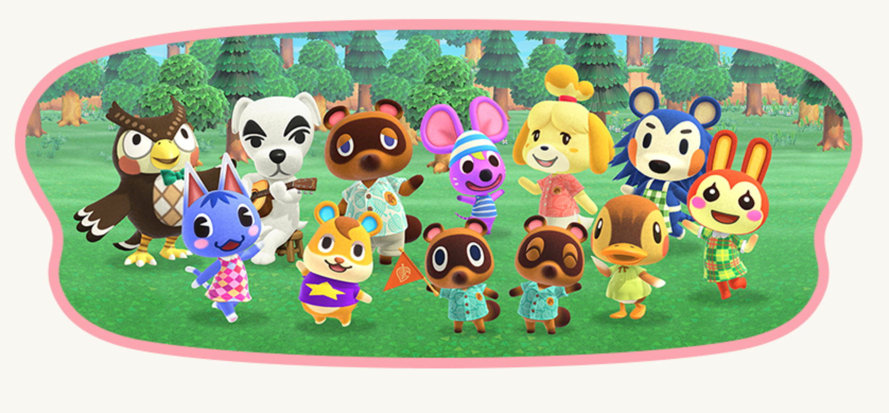

# natural-language-processing-project

- Data Science Team Members: Gabby Broussard

## Project Summary:
- The purpose of this project is to scape data from Github repository README files covering different Animal Crossing topics. The goal is to build a machine learning model that will predict what programming language the repository is based off of the given text in the README.

## Project Goals:
- Deliver a notebook presentation of models used to isolate drivers of increased length of time spent in the hospital.
- Use clustering methodologies to engineer new features and visualize factors that contribute to length of time spent in the hospital. 
- All files referenced in this presentation are available in the github repository for this project: https://github.com/GabbyBarajasBroussard/natural-language-processing-project

## Conclusion and Takeaways
- The most common language used is Javascript followed by Python
- All models beat baseline but linear regression beat baseline the most with a 0.571 accuracy on train and 0.5 accuracy on validate.
- One of the most common phrases is rryywwss suggesting that many of the animal crossing repos cover how to get hybrid flowers in the game
- Important to note that even if there are close to 1,000 instances of having a repo, many may not have a readme. The larger the sample will yield better results.

Progression through the Data Science Pipeline:
PLAN -> ACQUIRE -> PREPARE -> EXPLORE -> MODEL -> DELIVER

Each step in my process is recorded and staged on a Trello board at: https://trello.com/b/CoF5AaWI/nlp-project

## Plan:
- Plan a website or a topic to scrape data on
- Create GitHub organization and set up GitHub repo, to include readme.md and .gitignore.
- Brainstorm a list of questions and form hypotheses about how variables might impact one another.
- Create Trello Board to organize time
## Acquire:
- Have an env.py file created with credentials to access data
- Read data using acquire.py functions.
- Write data into a csv to use later.
## Prepare:
- Carefully reviewed data, identifying any missing, erroneous, or invalid values.
- Explored value counts of the dataframe
- Created and called a function, prepare, as a reproducible component that cleans/prepares data for analysis by: handling missing values, adjusts data types, handles any data integrity
- Split the data into train, validate and test sets.
## Explore:
- Visualized all combination of variables to explore relationships.
- Summarized takeaways and conclusions.
- Vectored data to create numerical values for alphabetical values.

## Model:

- Developed a baseline model.
- Modeled train and validate data on Linear Regression, K-Nearest Neighbors, and Random Forest Clasffier.
- Modeled test on Linear Regression.

# Deliver:

- Clearly document all code in a reproducible Jupyter notebook called Walkthrough.
- A well-documented jupyter notebook that contains your analysis called Walkthrough.
- One or two google slides suitable for a general audience that summarize your findings.
   -  Include a well-labelled visualization in your slides.
# Instructions for Reproducing My Findings:
- Start by cloning the github repository on your From your terminal command line, type:
 git@github.com:GabbyBarajasBroussard/natural-language-processing-project.git

- Download the following files from https://github.com/GabbyBarajasBroussard/natural-language-processing-project to your working directory:
 - acquire.py
 - prepare.py
 - wrangle.py

## Sources:
- Data Obtained From Github Repository Search Scrape
- Image From: https://www.nintendo.co.uk/Games/Nintendo-Switch/Animal-Crossing-New-Horizons-1438623.html 

  
